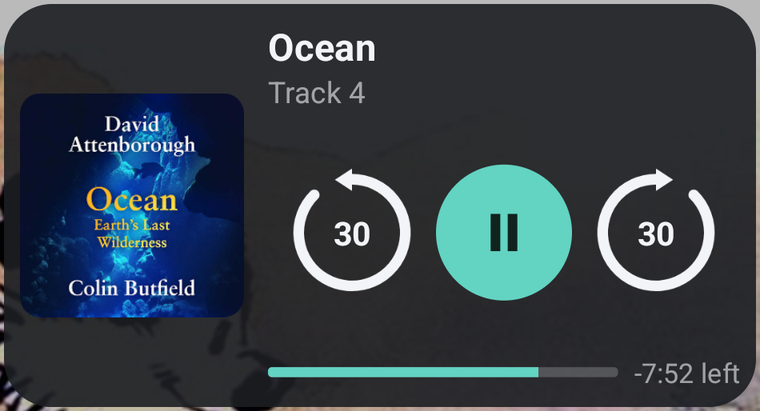
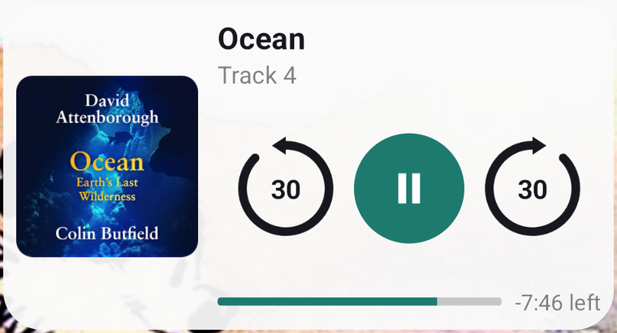
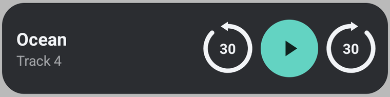
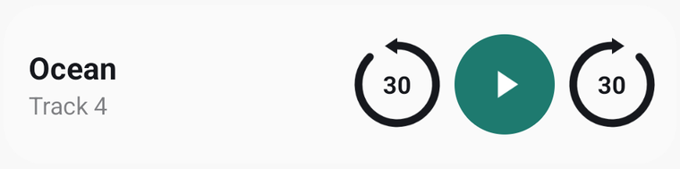

# Audiobook Widget

[](https://github.com/trevorscottprice/android-audiobook-widget/actions/workflows/build.yml)

An Android home screen widget for audiobook players, in the spirit of Audible's:
cover art, book title, skip back / play-pause / skip forward, and a progress bar
with time remaining.

## Why not a generic media widget?

Plenty of universal media-control widgets exist and they work fine. They are
built for music, though, and a book is not an album:

- **It seeks by time, not by track.** Music widgets give you previous / next
  track. An audiobook chapter is not a track, and jumping one is rarely what
  you want after missing a sentence.
- **The skip matches the number on the button.** It issues an explicit
  `seekTo` rather than the session's own rewind, because a player's native
  interval may be something else entirely — Chirp's is 15 seconds, so a widget
  that delegates would jump 15 while the icon read 30.
- **Progress is book-scale and speed-corrected.** Time remaining is for the
  current item, and the position extrapolation multiplies by
  `PlaybackState.playbackSpeed` — audiobook listeners rarely sit at 1.0x, and
  ignoring that makes the bar drift between updates.
- **The subtitle prefers the publisher.** Some players put an internal chapter
  id in `DISPLAY_SUBTITLE` (Chirp shows things like `WARBREAKER1P02`), so
  `METADATA_KEY_ARTIST` is tried first.
- **No permissions, no network, no accounts.** The manifest declares zero
  `uses-permission` entries; it cannot reach the internet, so there is nothing
  to serve ads or telemetry with. Notification access is the one thing you
  grant, and it is what the media-session API requires.

If what you actually want is album art with previous / next track, a generic
music widget is the better tool.

## What it works with

Any Android app that publishes a standard [`MediaSession`][mediasession] — the
same thing that drives your lock screen controls, Bluetooth headphone buttons,
Android Auto and Wear OS. No integration on the player's side is needed, and
nothing app-specific is hardcoded: the widget reads sessions through
[`MediaSessionManager.getActiveSessions`][getactivesessions] and sends commands
back through [`MediaController.TransportControls`][transportcontrols].

In practice that means it works with most audiobook and podcast players. What
you get depends on what the player's session advertises:

| Player publishes | Widget shows / does |
| --- | --- |
| `METADATA_KEY_TITLE` | Book title |
| `METADATA_KEY_ARTIST` | Subtitle (publisher or narrator) |
| `METADATA_KEY_ALBUM_ART` | Cover art |
| `METADATA_KEY_DURATION` | Progress bar and time remaining |
| `ACTION_SEEK_TO` | Skips of exactly the configured amount |
| `ACTION_REWIND` / `ACTION_FAST_FORWARD` | Fallback skips, at the player's own interval |

It ships with auto-detection for [Chirp](https://www.chirpbooks.com/); for
anything else, pick the app from a list in the setup screen.

[mediasession]: https://developer.android.com/reference/android/media/session/MediaSession
[getactivesessions]: https://developer.android.com/reference/android/media/session/MediaSessionManager#getActiveSessions(android.content.ComponentName)
[transportcontrols]: https://developer.android.com/reference/android/media/session/MediaController.TransportControls

> Not affiliated with, endorsed by, or sponsored by Chirp, BookBub, Audible, or
> any other player. It contains no code or assets from those apps.

Two sizes. **4x2** with cover art, progress and time remaining:

| Dark | Light |
| --- | --- |
|  |  |

**4x1** compact, for when a row is all you can spare — book info and controls,
no cover art and no progress bar:

| Dark | Light |
| --- | --- |
|  |  |

Both follow the system theme. Cover art shown belongs to its respective
publisher and appears only to illustrate the layout.

## How it works

The widget is a separate app rather than a plugin, so it drives the player the
same way your lock screen and headphone buttons do — through the `MediaSession`
the player already publishes while playing. Nothing is scraped, no private API
is used, and the player's servers are never contacted.

- `SessionListenerService` is a `NotificationListenerService`. Being an enabled
  notification listener is what grants permission to read and control other
  apps' media sessions (`MediaSessionManager.getActiveSessions`). It also stays
  resident, so it can push the widget an update the moment playback changes.
- `WidgetRender` holds the rendering and transport logic shared by every size.
  A `Size` enum pairs each layout with flags for the optional pieces it
  contains; RemoteViews throws if you address a view id the layout does not
  have, so `hasCover` / `hasProgress` are load-bearing rather than cosmetic.
- `AudiobookWidgetProvider` (4x2) and `CompactWidgetProvider` (4x1) each render
  their size. Both aim their buttons at `AudiobookWidgetProvider`, which handles
  transport for every size and then repaints all placed widgets: a receiver is
  live whether or not an instance of its size is on screen.
- `MediaSessions` locates the player's session and holds the two preferences.
- `MainActivity` is the one-time setup screen.

Skip buttons prefer an explicit `seekTo` so the jump is exactly the configured
amount, falling back to the session's own rewind / fast-forward when seeking is
not supported. This matters: a player's own skip may be a different interval
than the one on the button. Chirp's, for instance, is 15 seconds.

## Setup on the phone

1. Install the APK.
2. Open **Audiobook Widget** and grant **notification access** (step 1).
3. Confirm the detected player, or pick it from the list (step 2).
4. Choose a skip amount — 10, 15, 30 or 60 seconds (step 3).
5. Long-press the home screen → **Widgets** → drag on either
   **Audiobook Widget** (4x2) or **Audiobook Widget (compact)** (4x1). Both can
   be placed at once; they stay in sync.

Start a book and the widget fills in. With nothing playing it shows
"Nothing playing" and opens the player when tapped.

## Building

Requires JDK 17 and the Android SDK (platform 35, build-tools 35.0.0). Gradle
itself is not a prerequisite — the wrapper fetches the pinned version. Create
`local.properties` pointing at your SDK, or set `ANDROID_HOME` instead:

```properties
sdk.dir=C:/Users/you/Android/Sdk
```

Use forward slashes — it is a Java properties file, so a Windows path with
backslashes will read `\t` and friends as escape sequences.

Then build and install in one step — PowerShell:

```powershell
.\build-and-install.ps1
```

macOS or Linux:

```bash
./build-and-install.sh
```

Either one builds, installs to the connected device, and opens the setup
screen. If no device is attached it says what to enable on the phone and
leaves the APK for you.

Or by hand:

```powershell
$env:JAVA_HOME = '<your JDK 17>'
$env:ANDROID_HOME = '<your Android SDK>'
.\gradlew assembleDebug
adb install -r app\build\outputs\apk\debug\app-debug.apk
```

On macOS or Linux:

```bash
export JAVA_HOME=<your JDK 17>
export ANDROID_HOME=<your Android SDK>
./gradlew assembleDebug
adb install -r app/build/outputs/apk/debug/app-debug.apk
```

Output lands at `app/build/outputs/apk/debug/app-debug.apk`.

## Continuous integration

`.github/workflows/build.yml` assembles the debug APK and runs `lintDebug` on
every push to `main` and every pull request, and uploads both the APK and the
lint report as artifacts — so you can grab a build without a toolchain.

Lint is worth having here: a widget is built from RemoteViews and provider
metadata, where a wrong view id or a malformed `appwidget-provider` compiles
happily and only fails on the home screen.

Pushing a `v*` tag additionally attaches the APK to a GitHub release. Note it
is debug-signed, so it is fine for sideloading and not for Play.

## Layout sizing

Two things make the widget layout unintuitive, both worth knowing before
changing `res/layout/widget_player.xml` or `res/layout/widget_compact.xml`:

**The host scales the whole widget.** On Samsung One UI the instance is laid out
at its nominal cell size and then scaled down. Read the real numbers instead of
guessing from a screenshot:

```powershell
adb shell dumpsys appwidget   # find the instance, read its options Bundle
```

At 4x2 on a 480dpi device this reports `appWidgetMinWidth=376`,
`appWidgetMinHeight=201` and `hsResizeRatio=0.8333`. So the layout is authored
against 376x201dp but renders at about 313x168dp — every dp, including text
sizes, comes out ~17% smaller than written.

**The right column must be `match_parent`.** If it is `wrap_content` the whole
block floats vertically and leaves dead bands above and below, no matter how
large the individual elements get. It fills the height, with the control row on
`layout_weight="1"` so the title pins to the top, the progress row pins to the
bottom, and the buttons take up the slack in between.

Current 4x2 sizes: cover 112dp, all three buttons 68dp, glyphs 64dp, title 17sp.
The control row needs `3 x 68 + 2 x 8 = 220dp`, against roughly 236dp of column
width — so growing the buttons further means shrinking the cover first.

The 4x1 has no cover to trade against, so its buttons are 56dp and the text
block takes whatever width is left.

## Notes

- Built with the debug key, so `adb install` works directly. It is not
  Play-Store-signed.
- The widget refreshes every 5 seconds while playing and instantly on any
  play / pause / track change.
- Cover art is scaled to 256px before crossing to the launcher; RemoteViews have
  a hard IPC size limit and full-size art will blow past it.
- The player's package name is stored in preferences, not hardcoded at runtime.
  If auto-detection misses, pick the app in step 2.
- Some players put an internal chapter id in `METADATA_KEY_DISPLAY_SUBTITLE`, so
  the subtitle prefers `METADATA_KEY_ARTIST` (usually the publisher or narrator)
  and falls back to the id.

## License

MIT — see [LICENSE](LICENSE).
